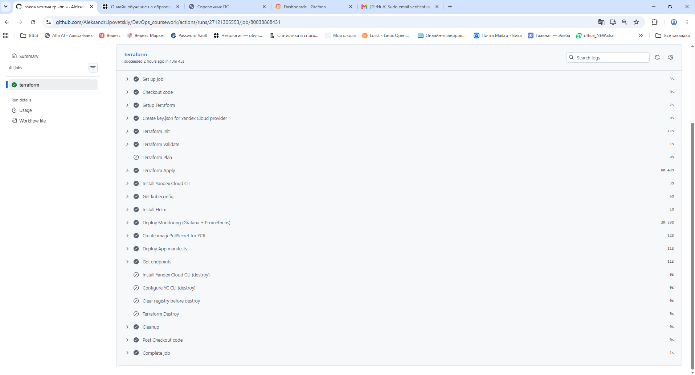
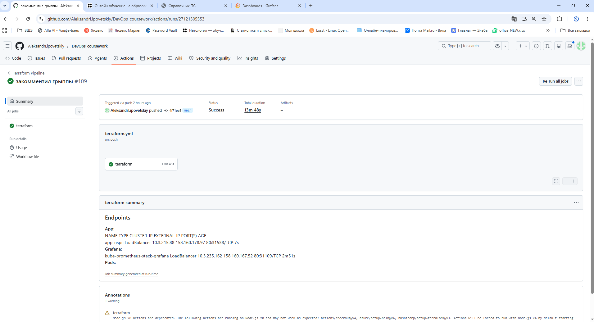
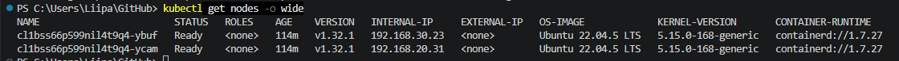
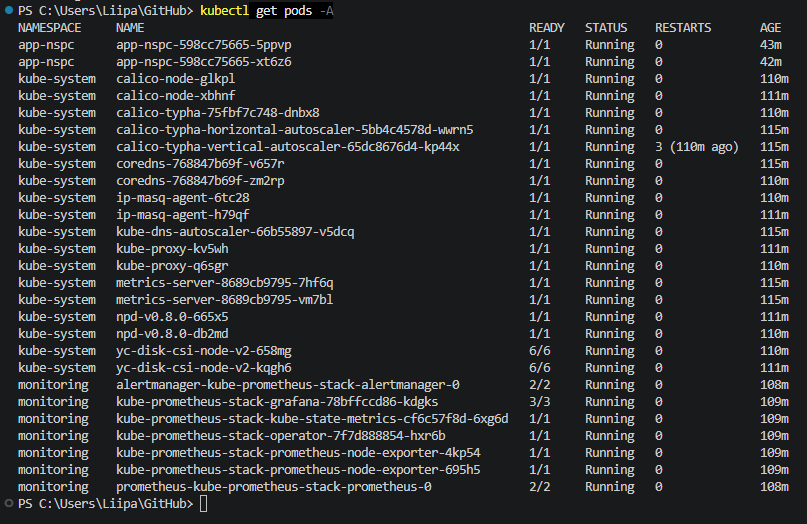
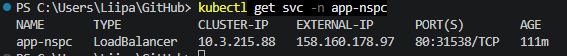
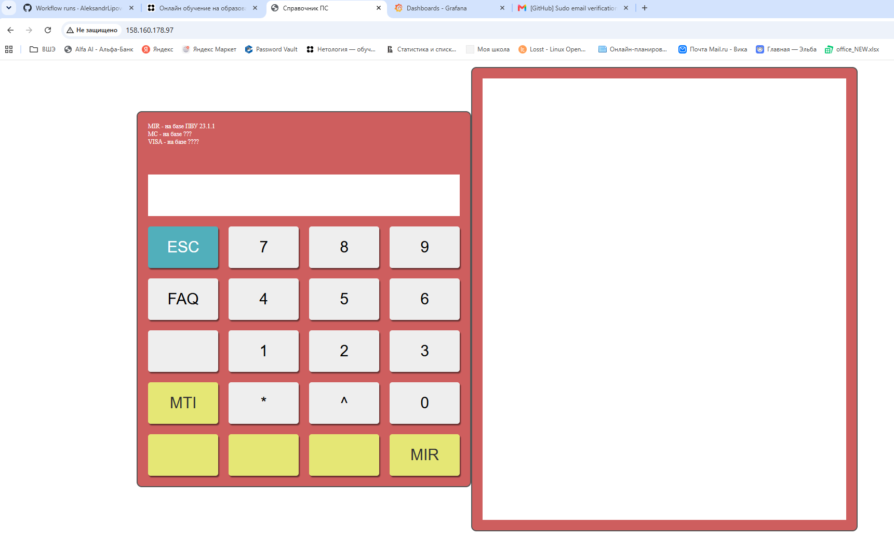
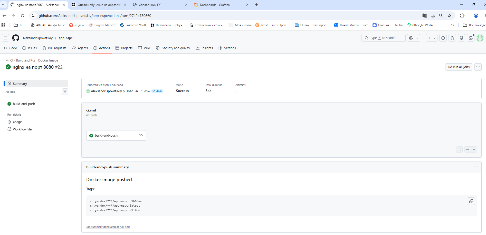
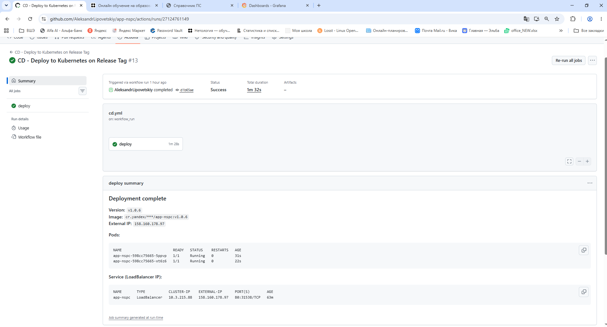
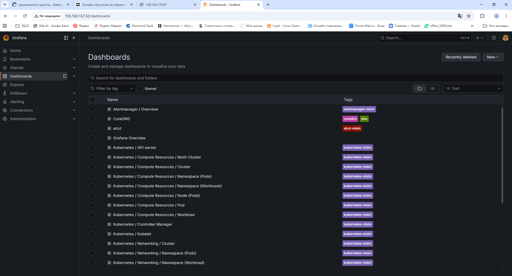
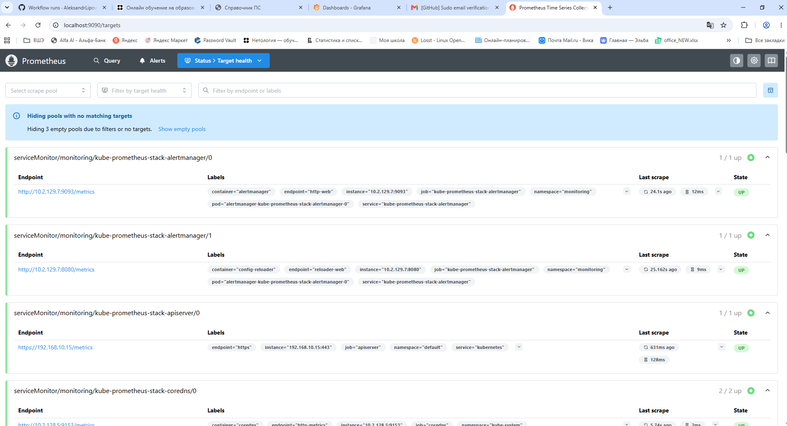

# Дипломный практикум в Yandex.Cloud — Липовецкий Александр Владимирович

| | |
|---|---|
| **Инфраструктура (Terraform)** | [AleksandrLipovetskiy/DevOps_coursework](https://github.com/AleksandrLipovetskiy/DevOps_coursework) |
| **Тестовое приложение** | [AleksandrLipovetskiy/app-nspc](https://github.com/AleksandrLipovetskiy/app-nspc) |
| **Kubernetes-манифесты** | [app-nspc/k8s/](https://github.com/AleksandrLipovetskiy/app-nspc/tree/main/k8s) |
| **Ссылка на приложение** | `http://<LoadBalancer-IP>` (IP из `kubectl get svc -n app-nspc`) |
| **Grafana** | `http://<Grafana-LB-IP>` (IP из `kubectl get svc -n monitoring`) |

---

## Содержание

1. [Архитектура](#архитектура)
2. [Сетевая топология](#сетевая-топология)
3. [Состав Terraform-ресурсов](#состав-terraform-ресурсов)
4. [Быстрый старт с нуля](#быстрый-старт-с-нуля)
5. [GitHub Actions Secrets](#github-actions-secrets)
6. [CI/CD пайплайны](#cicd-пайплайны)
7. [Мониторинг](#мониторинг)
8. [Логирование](#логирование)
9. [Проверка работоспособности](#проверка-работоспособности)
10. [Безопасный доступ через bastion](#безопасный-доступ-через-bastion)
11. [Безопасность](#безопасность)

---

## Архитектура

```
┌─────────────────────────────────────────────────────────────────┐
│                       Yandex.Cloud                              │
│                                                                  │
│  ┌──────────────────────────────────────────────────────────┐   │
│  │  VPC: vpc-network-prod                                    │   │
│  │                                                           │   │
│  │  ┌─────────────────┐    ┌──────────────────────────────┐ │   │
│  │  │  Public Subnet  │    │    Private Subnets           │ │   │
│  │  │ 192.168.10.0/24 │    │  ru-central1-b (nodes)       │ │   │
│  │  │  ru-central1-a  │    │  192.168.20.0/24             │ │   │
│  │  │                 │    │  ru-central1-d (nodes)       │ │   │
│  │  │  ┌───────────┐  │    │  192.168.30.0/24             │ │   │
│  │  │  │  bastion  │  │    │  ru-central1-a (spare)       │ │   │
│  │  │  │(public IP)│  │    │  192.168.40.0/24             │ │   │
│  │  │  └─────┬─────┘  │    │                              │ │   │
│  │  └────────│─────────┘   │  ┌──────────────────────┐   │ │   │
│  │           │             │  │  K8s Cluster          │   │ │   │
│  │           │ SSH tunnel  │  │  (Regional Master)    │   │ │   │
│  │           │             │  │  ┌────────┐ ┌──────┐  │   │ │   │
│  │           └─────────────┼──┤  │ Node1  │ │Node2 │  │   │ │   │
│  │                         │  │  │(no pub)│ │(nopub│  │   │ │   │
│  │                         │  │  └────────┘ └──────┘  │   │ │   │
│  │                         │  └──────────────────────┘   │ │   │
│  │                         │         │  NAT Gateway       │ │   │
│  │                         └─────────┴────────────────────┘ │   │
│  └──────────────────────────────────────────────────────────┘   │
│                                                                  │
│  ┌──────────────────────┐   ┌────────────────────────────────┐  │
│  │  Container Registry  │   │  Object Storage (TF State)     │  │
│  │  (app-nspc images)   │   │  bucket: tf-state-diplom       │  │
│  └──────────────────────┘   └────────────────────────────────┘  │
└─────────────────────────────────────────────────────────────────┘

         ┌──────────────┐         ┌─────────────────────────┐
         │  Разработчик │         │     GitHub Actions       │
         │  (человек)   │         │  (Terraform / CI / CD)  │
         └──────┬───────┘         └───────────┬─────────────┘
                │                             │
                │ SSH → bastion → kubectl     │ Напрямую к pub IP
                │ туннель                     │ мастера (через SG)
                └─────────────┬───────────────┘
                              │
                         K8s API Server
```

**Схема доступа:**
- **Люди** → SSH на bastion → kubectl tunnel через bastion → K8s API (private IP)
- **GitHub Actions** → напрямую к публичному IP мастера (разрешено через Security Group по CIDR GitHub Actions)
- **Worker-ноды** → без публичных IP, исходящий трафик только через NAT Gateway

---

## Сетевая топология

| Подсеть | CIDR | Зона | Назначение |
|---------|------|------|------------|
| `public-subnet` | 192.168.10.0/24 | ru-central1-a | Bastion host |
| `private-subnet-1` | 192.168.20.0/24 | ru-central1-b | K8s worker-ноды |
| `private-subnet-2` | 192.168.30.0/24 | ru-central1-d | K8s worker-ноды |
| `private-subnet-3` | 192.168.40.0/24 | ru-central1-a | Резерв для расширения |

Все приватные подсети маршрутизируют `0.0.0.0/0` через общий NAT Gateway.

---

## Состав Terraform-ресурсов

### Сеть (`terraform/main.tf`)
| Ресурс | Имя | Описание |
|--------|-----|----------|
| `yandex_vpc_network` | `vpc-network-prod` | Основная VPC |
| `yandex_vpc_subnet` × 4 | public, private-1/2/3 | Подсети в 3 зонах |

### Kubernetes (`terraform/cluster.tf`)
| Ресурс | Имя | Параметры |
|--------|-----|-----------|
| `yandex_kubernetes_cluster` | `app-nspc-cluster` | K8s 1.32, STABLE, Regional master (3 зоны) |
| `yandex_kubernetes_node_group` | `app-nspc-nodes` | 2 ноды, standard-v2, 2 CPU / 4 GB RAM / 64 GB |

- Network Policy: **Calico**
- Pod CIDR: `10.2.0.0/16`, Service CIDR: `10.3.0.0/16`
- Мастер с публичным IP (для GitHub Actions CI/CD)
- Ноды без публичных IP (безопасность)
- Auto-upgrade и auto-repair включены

### Безопасность (`terraform/security_groups.tf`)
| Security Group | Правила |
|----------------|---------|
| `bastion-sg` | SSH (22) с разрешённых IP, ICMP внутри VPC |
| `k8s-master-sg` | K8s API (443) от bastion и GitHub Actions CIDR |
| `k8s-nodes-sg` | Kubelet (10250) от мастера, NodePort (30000-32767) внутри, HTTP/HTTPS от любых |

### Сеть / NAT (`terraform/nat_gateway.tf`)
| Ресурс | Описание |
|--------|----------|
| `yandex_vpc_gateway` | Shared Egress NAT Gateway |
| `yandex_vpc_route_table` | Маршрут `0.0.0.0/0` через NAT для приватных подсетей |

### Вычисления (`terraform/vmbastion.tf`)
| Ресурс | Параметры |
|--------|-----------|
| `yandex_compute_instance` `bastion` | Ubuntu 24.04 LTS, standard-v3, 4 CPU / 4 GB RAM, preemptible |

### Реестр образов (`terraform/registry.tf`)
| Ресурс | Имя |
|--------|-----|
| `yandex_container_registry` | `app-nspc-registry` |

### IAM (`terraform/iam.tf`)
Ссылается на существующий сервисный аккаунт с правами `editor` и `container-registry.images.pusher`.

### Terraform Backend (`terraform/backend.tf`)
- S3-совместимое хранилище Yandex Object Storage
- Bucket: `tf-state-diplom`, Key: `prod/terraform.tfstate`

### Outputs (`terraform/outputs.tf`)
```bash
cluster_id            # ID Kubernetes-кластера
cluster_endpoint      # Публичный IP K8s API-сервера
registry_repository   # Полный путь к репозиторию образов
bastion_public_ip     # Публичный IP bastion-хоста
```

---

## Быстрый старт с нуля

### Предварительные требования

- [Terraform](https://developer.hashicorp.com/terraform/downloads) ≥ 1.8.4
- [kubectl](https://kubernetes.io/docs/tasks/tools/)
- [Yandex Cloud CLI](https://yandex.cloud/ru/docs/cli/quickstart) (`yc`)
- [Helm](https://helm.sh/docs/intro/install/) ≥ 3.x
- Docker (опционально, для локальной сборки образов)

### Шаг 1 — Подготовить Yandex.Cloud

```bash
# Создать сервисный аккаунт и скачать JSON-ключ
yc iam service-account create --name terraform-sa
yc iam key create --service-account-name terraform-sa -o key.json

# Назначить роли
yc resource-manager folder add-access-binding <FOLDER_ID> \
  --role editor --subject serviceAccount:<SA_ID>
yc resource-manager folder add-access-binding <FOLDER_ID> \
  --role container-registry.images.pusher --subject serviceAccount:<SA_ID>

# Создать Object Storage bucket для Terraform state
yc storage bucket create --name tf-state-diplom

# Создать S3-ключи для доступа к bucket
yc iam access-key create --service-account-name terraform-sa
```

### Шаг 2 — Настроить GitHub Secrets

Добавить секреты в репозиторий **DevOps_coursework** (Settings → Secrets → Actions):

| Secret | Описание |
|--------|----------|
| `YC_SERVICE_ACCOUNT_KEY` | Содержимое `key.json` |
| `YC_CLOUD_ID` | ID облака (`yc config get cloud-id`) |
| `YC_FOLDER_ID` | ID каталога (`yc config get folder-id`) |
| `YC_ACCESS_KEY` | S3 Access Key (из шага 1) |
| `YC_SECRET_KEY` | S3 Secret Key (из шага 1) |
| `SSH_PUBLIC_KEY` | Публичный SSH-ключ (`cat ~/.ssh/id_rsa.pub`) |
| `REGISTRY_ID` | ID Container Registry (после первого `terraform apply`) |

### Шаг 3 — Запустить Terraform

**Вариант A — через GitHub Actions (рекомендуется):**

```
Репозиторий DevOps_coursework → Actions → Terraform Pipeline
→ Run workflow → workflow_action: apply
```

**Вариант B — локально:**

```bash
cd terraform

# Инициализировать backend
terraform init \
  -backend-config="access_key=<YC_ACCESS_KEY>" \
  -backend-config="secret_key=<YC_SECRET_KEY>"

# Проверить план
terraform plan -var="cloud_id=<CLOUD_ID>" -var="folder_id=<FOLDER_ID>" \
  -var="service_account_key_file=../key.json" -var="ssh_public_key=<PUB_KEY>"

# Применить
terraform apply ...same vars...
```

Terraform создаёт всю инфраструктуру (~5-10 минут) и сразу деплоит мониторинг и приложение.

### Шаг 4 — Получить адреса

```bash
cd terraform
terraform output
```

```
bastion_public_ip     = "X.X.X.X"
cluster_endpoint      = "Y.Y.Y.Y"
registry_repository   = "cr.yandex/<FOLDER_ID>/app-nspc"
```

### Шаг 5 — Настроить доступ к кластеру

```bash
# Через bastion (для людей)
scp scripts/setup-bastion.sh ubuntu@<BASTION_IP>:~/
ssh ubuntu@<BASTION_IP> "bash setup-bastion.sh app-nspc-cluster <YC_FOLDER_ID>"

# Настроить ~/.ssh/config
cat >> ~/.ssh/config << 'EOF'
Host bastion-nspc
  HostName <BASTION_IP>
  User ubuntu
  IdentityFile ~/.ssh/id_rsa

Host k8s-tunnel-nspc
  HostName <BASTION_IP>
  User ubuntu
  IdentityFile ~/.ssh/id_rsa
  LocalForward 6443 <CLUSTER_ENDPOINT>:443
  StrictHostKeyChecking no
EOF

# Подключиться через туннель
ssh -fN k8s-tunnel-nspc
export KUBECONFIG=/tmp/kube-via-bastion.yaml

kubectl get nodes
```

### Шаг 6 — Задеплоить приложение

**При пуше в `main`** репозитория `app-nspc` автоматически собирается и пушится образ с тегами `:latest` и `:<short-sha>`.

**При создании тега** (например `v1.0.0`) запускается полный CI/CD:

```bash
# В репозитории app-nspc
git tag v1.0.0
git push origin v1.0.0
# CI: сборка + push образа → CD: deploy в K8s
```

---

## GitHub Actions Secrets

### Репозиторий DevOps_coursework

| Secret | Значение |
|--------|----------|
| `YC_SERVICE_ACCOUNT_KEY` | JSON-ключ сервисного аккаунта (полное содержимое key.json) |
| `YC_CLOUD_ID` | ID облака |
| `YC_FOLDER_ID` | ID каталога |
| `YC_ACCESS_KEY` | S3 Access Key для Terraform backend |
| `YC_SECRET_KEY` | S3 Secret Key для Terraform backend |
| `SSH_PUBLIC_KEY` | Публичный SSH-ключ для bastion |
| `REGISTRY_ID` | ID Container Registry |

### Репозиторий app-nspc

| Secret | Значение |
|--------|----------|
| `YC_SERVICE_ACCOUNT_KEY` | JSON-ключ сервисного аккаунта |
| `YC_CLOUD_ID` | ID облака |
| `YC_FOLDER_ID` | ID каталога |
| `REGISTRY_ID` | ID Container Registry |

---

## CI/CD пайплайны

### Инфраструктурный пайплайн (`DevOps_coursework/.github/workflows/terraform.yml`)

```
Триггеры:
  push → main (terraform/**)    → terraform apply + deploy
  pull_request → main           → terraform plan (проверка)
  workflow_dispatch             → plan / apply / destroy (на выбор)
```

**Шаги при `apply`:**
1. `terraform init` — инициализация с S3 backend
2. `terraform validate` — проверка синтаксиса
3. `terraform apply` — создание/обновление инфраструктуры
4. Установка `yc` CLI + получение kubeconfig
5. `helm upgrade --install kube-prometheus-stack` — деплой мониторинга
6. Создание `ycr-secret` (docker-registry secret) в namespace `app-nspc`
7. `kubectl apply` манифестов приложения из репозитория `app-nspc`
8. Вывод endpoints в Job Summary

**Destroy (только ручной запуск):**
- Очистка образов из Container Registry
- `terraform destroy`

---

### CI пайплайн приложения (`app-nspc/.github/workflows/ci.yml`)

```
Триггеры:
  push → main, develop          → сборка + push :latest, :<sha>
  push → tags v*                → сборка + push :vX.Y.Z
  workflow_dispatch             → ручной запуск
```

**Шаги:**
1. Checkout кода
2. Setup Docker Buildx
3. Авторизация в Yandex Container Registry (`cr.yandex`)
4. Вычисление тегов образа (`:<sha>`, `:latest`, `:vX.Y.Z`)
5. `docker buildx build --push` с кешированием через GitHub Actions Cache
6. Вывод тегов в Job Summary

---

### CD пайплайн приложения (`app-nspc/.github/workflows/cd.yml`)

```
Триггеры:
  workflow_run (CI завершился успешно)  → deploy, только если есть тег vX.Y.Z
  workflow_dispatch (tag input)         → ручной деплой конкретной версии
```

**Шаги при наличии тега:**
1. Определение версии из git-тега (`git tag --points-at <sha>`)
2. Получение kubeconfig через `yc managed-kubernetes cluster get-credentials`
3. Создание/обновление `ycr-secret` с IAM-токеном
4. `kubectl apply` — namespace, serviceaccount, rbac, networkpolicy
5. `sed` — подстановка тега образа в `deployment.yaml`
6. `kubectl apply` — deployment + service
7. `kubectl rollout status` — ожидание готовности (timeout 5 мин)
8. Ожидание LoadBalancer IP (до 3 мин)
9. Вывод итогов в Job Summary

> **Примечание:** В `k8s/deployment.yaml` указан образ-заглушка `cr.yandex/<registry-id>/app-nspc:latest`.
> При деплое CD-пайплайн подставляет реальный registry ID и тег через `sed`.
> Это сделано для того, чтобы манифест был валидным без CI-контекста.

---

## Мониторинг

Мониторинг разворачивается автоматически при `terraform apply` через Helm-чарт `kube-prometheus-stack`.

**Состав стека:**

| Компонент | Назначение |
|-----------|------------|
| Prometheus | Сбор метрик (retention 24h) |
| Grafana | Визуализация (LoadBalancer, admin/admin) |
| Alertmanager | Управление алертами |
| Node Exporter | Метрики хоста (CPU, RAM, disk, network) |
| kube-state-metrics | Метрики Kubernetes-объектов |

**Ресурсы Prometheus:** 100m–500m CPU, 512Mi–1Gi RAM  
**Хранилище:** Grafana — 5Gi PVC, AlertManager — 5Gi PVC

### Проверка мониторинга

```bash
# Статус подов
kubectl get pods -n monitoring

# Доступ к Grafana через port-forward (если нет внешнего IP)
kubectl port-forward -n monitoring svc/kube-prometheus-stack-grafana 3000:80
# Открыть http://localhost:3000  (admin / admin)

# Prometheus UI
kubectl port-forward -n monitoring svc/kube-prometheus-stack-prometheus 9090:9090
# Открыть http://localhost:9090

# Получить внешний IP Grafana (LoadBalancer)
kubectl get svc -n monitoring kube-prometheus-stack-grafana
```

### Встроенные дашборды Grafana

После входа в Grafana (Dashboards → Browse) доступны:
- **Kubernetes / Compute Resources / Cluster** — общий обзор кластера
- **Kubernetes / Compute Resources / Namespace (Pods)** — метрики по namespace
- **Node Exporter / Full** — метрики нод (CPU, RAM, disk, network)
- **Alertmanager / Overview** — статус алертов

---

## Логирование

В рамках данного проекта используется **операционное логирование через kubectl** — стандартный подход для Kubernetes.

### Логи приложения

```bash
# Логи подов приложения (последние 100 строк)
kubectl logs -n app-nspc deployment/app-nspc --tail=100

# Логи с follow
kubectl logs -n app-nspc deployment/app-nspc -f

# Логи конкретного пода
kubectl logs -n app-nspc <pod-name>

# Предыдущий контейнер (если был рестарт)
kubectl logs -n app-nspc <pod-name> --previous
```

### Логи мониторинга

```bash
# Prometheus
kubectl logs -n monitoring -l app.kubernetes.io/name=prometheus

# Grafana
kubectl logs -n monitoring -l app.kubernetes.io/name=grafana

# Alertmanager
kubectl logs -n monitoring -l app.kubernetes.io/name=alertmanager
```

### Логи системных компонентов

```bash
# CoreDNS
kubectl logs -n kube-system -l k8s-app=kube-dns

# Kube Proxy
kubectl logs -n kube-system -l k8s-app=kube-proxy
```

> Для production-окружения рекомендуется добавить централизованный сбор логов
> (например, Loki + Promtail или Elasticsearch + Fluentbit). В текущей учебной
> инсталляции используется штатный `kubectl logs`.

---

## Проверка работоспособности

### Инфраструктура

```bash
# Terraform outputs
cd terraform && terraform output -json

# Статус нод кластера
kubectl get nodes -o wide

# Все поды во всех namespace
kubectl get pods --all-namespaces
```

### Приложение

```bash
# Поды и сервисы приложения
kubectl get pods -n app-nspc -o wide
kubectl get svc -n app-nspc

# Проверить доступность (подставить External-IP из get svc)
curl -I http://<EXTERNAL-IP>

# Деплоймент
kubectl describe deployment app-nspc -n app-nspc

# Docker-образы в Container Registry
yc container repository list --registry-name app-nspc-registry
yc container image list --repository-name app-nspc
```

### Мониторинг

```bash
kubectl get pods -n monitoring -o wide
kubectl get svc -n monitoring

# Prometheus targets
kubectl port-forward -n monitoring svc/kube-prometheus-stack-prometheus 9090:9090
# http://localhost:9090/targets — должны быть все targets в состоянии UP
```

### Безопасность

```bash
# NetworkPolicy
kubectl get networkpolicy -n app-nspc -o yaml

# RBAC
kubectl auth can-i create deployments \
  --as=system:serviceaccount:app-nspc:app-nspc-sa -n app-nspc

# Проверка non-root
kubectl get pod -n app-nspc -o jsonpath='{.items[*].spec.securityContext}'

# ServiceAccount токены
kubectl get pod -n app-nspc -o yaml | grep automountServiceAccountToken
```

---

### Скриншоты / Доказательства результата

> Скриншоты размещены в папке [`docs/screenshots/`](docs/screenshots/).

#### Terraform pipeline — успешный запуск



#### `terraform output`



#### `kubectl get nodes -o wide`



#### `kubectl get pods --all-namespaces`



#### `kubectl get svc -n app-nspc`



#### Приложение в браузере



#### GitHub Actions — CI (сборка образа)



#### GitHub Actions — CD (деплой в Kubernetes)



#### Grafana — дашборд кластера



#### Prometheus — статус targets



---

## Безопасный доступ через bastion

### Схема подключения

```
Локальный ПК
    │
    │ SSH (port 22) → bastion (публичный IP)
    │
    └──→ bastion
             │
             │ kubectl tunnel (через SSH -L 6443:<CLUSTER_ENDPOINT>:443)
             │
             └──→ K8s API Server (приватный IP)
```

### Настройка bastion (однократно после `terraform apply`)

```bash
# 1. Скопировать скрипт на bastion
scp scripts/setup-bastion.sh ubuntu@<BASTION_IP>:~/

# 2. Запустить на bastion
ssh ubuntu@<BASTION_IP> "bash setup-bastion.sh app-nspc-cluster <YC_FOLDER_ID>"

# 3. Настроить ~/.ssh/config (локально)
Host bastion-nspc
  HostName <BASTION_IP>
  User ubuntu
  IdentityFile ~/.ssh/id_rsa

Host k8s-tunnel-nspc
  HostName <BASTION_IP>
  User ubuntu
  IdentityFile ~/.ssh/id_rsa
  LocalForward 6443 <CLUSTER_ENDPOINT>:443
  StrictHostKeyChecking no

# 4. Поднять туннель
ssh -fN k8s-tunnel-nspc

# 5. Использовать kubectl
export KUBECONFIG=/tmp/kube-via-bastion.yaml
kubectl get nodes
```

---

## Безопасность

| Аспект | Реализация |
|--------|------------|
| Сеть | Ноды без публичных IP, исходящий трафик через NAT |
| Доступ к кластеру | Только через bastion (SSH) или GitHub Actions (по CIDR) |
| Контейнер | Non-root user (uid 101), read-only root FS, dropped ALL capabilities |
| Pod Security | `seccompProfile: RuntimeDefault`, `runAsNonRoot: true` |
| NetworkPolicy | Default deny all, явный allow только для HTTP + DNS |
| RBAC | Минимальные права ServiceAccount, automount token: false |
| Реестр | IAM-токен ротируется при каждом деплое |
| TF State | Зашифрован в Object Storage, доступ через S3-ключи |

### Обновление IP-диапазонов GitHub Actions

```bash
# GitHub периодически обновляет IP-адреса runners
curl -s https://api.github.com/meta | jq '.actions'

# После обновления изменить terraform/variables.tf → github_actions_cidrs
# и применить terraform apply
```
